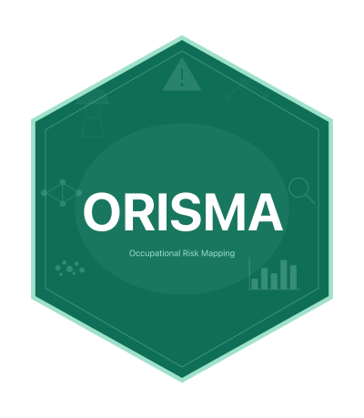

# orisma 

**Occupational Risk Integrated Systematic Mapping and Analysis**

<!-- badges: start -->
[](https://CRAN.R-project.org/package=orisma)
[](https://github.com/Aguilar-Elena/orisma/actions)
[](https://opensource.org/licenses/MIT)
<!-- badges: end -->

`orisma` is an R package for **systematic bibliometric mapping of occupational risk evidence**.

It is designed for researchers, occupational safety and health professionals, industrial hygienists, ergonomists, psychosocial risk specialists and prevention practitioners who need to understand whether the scientific literature on a given topic is actually connected to **workers, workplaces, exposure conditions and preventive decision-making**.

Unlike general bibliometric tools, `orisma` focuses on the **preventive usefulness** of scientific evidence. It does not only count publications or keywords. It helps identify whether a research field is technically abundant but weakly connected to real occupational exposure, workplace tasks or preventive action.

<hr>

## Why ORISMA?

Emerging technologies, new work processes and complex occupational hazards often generate a large scientific literature before their real workplace risks are fully understood.

This creates a practical and methodological problem:

> A topic may appear well studied, but the available evidence may still lack data on workers, real exposure conditions, tasks, sectors, controls or preventive recommendations.

`orisma` was created to detect this gap.

It helps answer questions such as:

- Is the literature technically abundant but weakly connected to real workers?
- Which occupational risk categories are over-represented or under-represented?
- Which articles are most useful for occupational risk assessment?
- Which studies connect technical science with applied prevention?
- Which risks require on-site assessment because the literature lacks worker-level evidence?
- Which records are probably off-topic, biomedical, clinical or weakly occupational and should be reviewed manually?

<hr>

## What does ORISMA do?

Starting from reference files exported from major bibliographic databases such as Web of Science, Scopus, PubMed, Dimensions, EBSCO and others, `orisma` runs a complete workflow.

Processing time depends on corpus size, file format, deduplication complexity and the number of risk categories analysed.

1. **Ingestion** — reads RIS, BibTeX and CSV files from multiple databases.
2. **Deduplication** — applies a three-step pipeline: exact DOI, normalised title and fuzzy matching.
3. **Relevance guard** — flags or excludes records with weak topic or occupational relevance.
4. **Risk extraction** — scans titles, abstracts and keywords against a 58-category occupational risk dictionary.
5. **Bibliometric analysis** — generates matrices, temporal trends, co-occurrence structures and risk distributions.
6. **Preventive indicators** — computes WRDI, RCS, MGP, ASS and Bridge Article Score.
7. **Priority ranking** — identifies articles with higher preventive usefulness.
8. **Reports** — generates bilingual HTML reports, practitioner risk sheets, extraction matrices and validation samples.

<hr>

## Main preventive bibliometric indicators

| Indicator | Full name | What it measures |
|---|---|---|
| **WRDI** | Worker-Risk Disconnection Index | Proportion of studies characterising a risk without direct worker exposure data |
| **RCS** | Risk Category Saturation Index | Relative dominance of each risk category compared with a uniform baseline |
| **MGP** | Material-Gap Profile | Ratio between a material's hazard potential and its coverage in the occupational health literature |
| **ASS** | Abstract Sufficiency Score | Amount of preventively useful information contained in each abstract, scored from 0 to 5 |
| **Bridge score** | Bridge Article Score | Degree to which a study connects technical science with applied occupational prevention |

<hr>

## Worker-Risk Disconnection Index (WRDI)

The **Worker-Risk Disconnection Index** measures the proportion of studies that characterise a risk without reporting direct data on workers or workplace exposure.

A high WRDI suggests that the literature is technically developed but weakly connected to real working conditions.

| WRDI value | Interpretation |
|---|---|
| 0.00-0.30 | Reasonable connection with worker-level evidence |
| 0.30-0.70 | Partial disconnection; manual review recommended |
| 0.70-1.00 | High technical-worker disconnection; on-site assessment is especially important |

WRDI is not a substitute for expert judgement. It is a signal that helps prioritise deeper review.

<hr>

## Risk Category Saturation Index (RCS)

The **Risk Category Saturation Index** measures whether a risk category is over-represented or under-represented compared with a uniform distribution across the dictionary.

It helps identify:

- dominant risk categories in the corpus;
- under-studied risk categories;
- risk areas where literature volume may not match preventive relevance;
- potential evidence gaps.

<hr>
## Material-Gap Profile (MGP)

The **Material-Gap Profile** is designed for corpora where records can be stratified by material, substance or agent.

It helps identify materials or agents that appear hazardous but remain poorly covered in the occupational health literature.

This is especially useful for topics such as:

- metal additive manufacturing;
- nanomaterials;
- battery manufacturing;
- advanced materials;
- chemical agents;
- biological agents;
- emerging technologies.

<hr>

## Abstract Sufficiency Score (ASS)

The **ASS** is a cumulative 0-5 score measuring how much preventively useful information an abstract contains.

| Score | Meaning |
|---|---|
| 0 | Non-informative for OHS purposes |
| 1 | Mentions a hazard but no occupational context |
| 2 | Mentions occupational or workplace context |
| 3 | Mentions exposure measurement or quantification |
| 4 | Mentions worker exposure with a result |
| 5 | Complete preventive abstract: worker population, exposure measurement, method and prevention |

The ASS is not a measure of study quality. It is a measure of how informative the abstract is for occupational prevention.

<hr>


## Installation

```r
# From CRAN
install.packages("orisma")

# Development version from GitHub
# install.packages("remotes")
remotes::install_github("Aguilar-Elena/orisma")
```

<hr>

## Minimal usage — 3 lines

```r
library(orisma)

refs   <- orm_load("my_references/")   # load RIS/BibTeX/CSV files
result <- orm_run(refs)                 # full pipeline (2-3 sec)
orm_report(result, lang = "en")         # generate all outputs
```

For **Spanish output**:

```r
options(orisma.lang = "es")
refs   <- orm_load("mis_referencias/")
result <- orm_run(refs)
orm_report(result, lang = "es", out_dir = "resultados/")
```

<hr>

## Complete function reference

| Function | For whom | What it does |
|---|---|---|
| `orm_load()` | Everyone | Multi-source ingestion with format auto-detection |
| `orm_dedup()` | Everyone | Three-step deduplication: DOI, title and fuzzy matching |
| `orm_relevance_guard()` | Both | Flags or excludes records with weak topic or occupational relevance |
| `orm_extract()` | Researcher | Risk category extraction via occupational risk dictionary |
| `orm_analyse()` | Researcher | Computes WRDI, RCS and MGP |
| `orm_autodim()` | Researcher | Automatic dimension discovery |
| `orm_dim_matrix()` | Researcher | Risk x dimension heatmap |
| `orm_ass()` | Both | Abstract Sufficiency Score per record |
| `orm_ass_plot()` | Both | ASS distribution plot |
| `orm_bridge()` | Both | Bridge article detection and classification |
| `orm_ranking()` | Both | Priority reading list |
| `orm_priority()` | Both | RED/AMBER/GREEN/GREY priority classification |
| `orm_run()` | Everyone | Complete ORISMA pipeline in one call |
| `orm_run_guarded()` | Everyone | Complete pipeline with relevance-control layer |
| `orm_report()` | Researcher | Full HTML report with visualisations and tables |
| `orm_risk_sheet()` | OHS practitioner | Actionable risk sheet |
| `orm_extraction_matrix()` | Both | Guided extraction template for PDF review |
| `orm_validate()` | Researcher | Manual validation sample |
| `orm_dict()` | Everyone | Load or customise the risk dictionary |

<hr>

## Outputs generated automatically

After running `orm_report()` and `orm_risk_sheet()`:

### For researchers
| File | Description |
|---|---|
| `orisma_report.html` | Interactive bilingual executive report with 7 plots |
| `orisma_corpus.csv` | All records after deduplication |
| `orisma_matrix.csv` | Binary risk category matrix (records x categories) |
| `orisma_indicators.csv` | WRDI, RCS, MGP per category |
| `prisma_log.csv` | PRISMA-compatible selection flow |
| `analysis.orisma` | Reproducibility certificate (JSON with MD5 hashes) |
| `plots/` | 7 publication-ready PNG plots |

### For OHS practitioners
| File | Description |
|---|---|
| `orisma_risk_sheet.html` | Actionable risk sheet with RED/AMBER/GREEN traffic light |
| `orisma_extraction_matrix.csv` | Pre-filled extraction template for PDF review |
| `orisma_priority_ranking.csv` | Top-20 priority articles by bridge + ASS score |
| `orisma_validation_sample.csv`| Manual validation sample |
<hr>

## Risk dictionary

The built-in dictionary covers **58 occupational risk categories** in **6 blocks**.

| Block | Area | Examples |
|---|---|---|
| A | Safety at work | Falls, collision, fire, explosion, work equipment |
| B | Industrial hygiene | Chemical agents, dust, noise, vibration, radiation |
| C | Ergonomics | Postures, manual handling, repetitive movements, workload |
| D | Psychosociology | Mental workload, autonomy, social support, violence, harassment |
| E | Biological hazards | Bacteria, viruses, fungi, parasites, biological agents |
| F | Emerging technologies | Robotics, AI, nanotechnology, additive manufacturing, wearables |

The dictionary can be extended for any domain:

```r
dict <- orm_dict()

# Add terms to an existing category
dict <- orm_dict_add_terms(dict, "nanomaterials", c("nano-aerosol", "NOAA"))

# Add a completely new category
dict <- orm_dict_add_category(dict,
  key      = "exoskeleton_risk",
  label_en = "Exoskeleton-related musculoskeletal risk",
  label_es = "Riesgo musculoesqueletico por exoesqueleto",
  terms    = c("exoskeleton", "powered exosuit", "wearable robot")
)
```

### The taxonomy as a standalone resource

The 58-category taxonomy is also published as an autonomous, citable resource under a
CC BY 4.0 licence, in CSV, JSON and SKOS/Turtle formats, so that it can be applied,
audited or extended independently of this package and outside R.

[](https://doi.org/10.5281/zenodo.22066582)

If you use the taxonomy — directly, or through any `orisma` function that depends on
`orm_dict()` — please cite it in addition to the package.
<hr>

## Supported databases

| Database | Recommended format | Batch limit |
|---|---|---|
| Web of Science | RIS (Plain text) | 1 000 |
| Scopus | RIS or CSV | 2 000 |
| PubMed | RIS | No limit |
| Dimensions | CSV or RIS | 2 500 |
| EBSCO (CINAHL, BSC) | RIS | 25 000 |
| ProQuest | RIS or BibTeX | 100 |
| Cochrane Library | RIS | No limit |
| Ovid / MEDLINE | RIS | 1 000 |
| ScienceDirect | RIS | No limit |
| The Lens (free) | RIS or CSV | No limit |

Export all databases in **RIS format**, place files in a folder, and run `orm_load("folder/")`. ORISMA detects the source database automatically from the filename.

<hr>


## Bridge articles

A **bridge article** connects technical science with applied OHS prevention. It simultaneously addresses:

1. Technology or process
2. Hazardous agent
3. Workers (real workplace population)
4. Exposure measurement
5. Preventive recommendation

Articles meeting 4-5 criteria = **Strong bridge** (highest priority for reading).
Articles meeting 3 criteria (must include workers + measurement) = **Partial bridge**.

<hr>

## Methodological note

ORISMA uses dictionary-based automatic classification. This may produce false positives. Manual validation of a representative sample is recommended using `orm_validate()`, which computes Cohen's Kappa between automatic and manual classification. A Kappa >= 0.7 is acceptable for high-impact journal publication.

ORISMA does not include country-specific regulations or limit values, as these vary by jurisdiction. The practitioner applies the relevant national/regional regulation based on the risk categories identified.

<hr>

## Limitations

ORISMA relies primarily on bibliographic metadata, titles, abstracts and keywords. It may miss information that appears only in the full text.

Automatic classification may produce false positives or false negatives, especially when terms are used differently across disciplines. This is why ORISMA includes a relevance guard and a validation workflow.

WRDI, ASS and Bridge Score should be interpreted as prioritisation and mapping indicators, not as definitive quality assessment tools.

Country-specific legal requirements, occupational exposure limits and regulatory thresholds are not embedded in ORISMA because they vary by jurisdiction. Practitioners should apply the relevant national or regional legislation after identifying the risk categories.


<hr>

## Citation

If you use `orisma` in your research, please cite the software:

```
Aguilar-Elena, R., & Delgado-García, A. (2026). orisma: Occupational Risk
Integrated Systematic Mapping and Analysis. R package version 0.1.0.
https://doi.org/10.32614/CRAN.package.orisma
```

If you use the risk category taxonomy, please also cite it:

```
Aguilar-Elena, R., & Delgado-García, A. (2026). ORISMA Occupational Risk Category
Taxonomy: a bilingual controlled vocabulary of 58 occupational risk categories for
bibliometric mapping of occupational safety and health literature (Version 1.0.0)
[Data set]. Zenodo. https://doi.org/10.5281/zenodo.22066582
```

In R, `citation("orisma")` returns both entries.

<hr>
<hr>

## Authors

**PhD. Raul Aguilar-Elena** &middot; raguilar@universidadviu.com  
Occupational Risk Prevention and Occupational Health Research Group (GPRL)  
Universidad Internacional de Valencia (VIU), Valencia, Spain

**Ana Delgado-Garcia** &middot; a.delgado@usal.es  
Universidad de Salamanca (USAL), Salamanca, Spain

<hr>

## License

MIT © 2025 Raul Aguilar-Elena & Ana Delgado-Garcia

